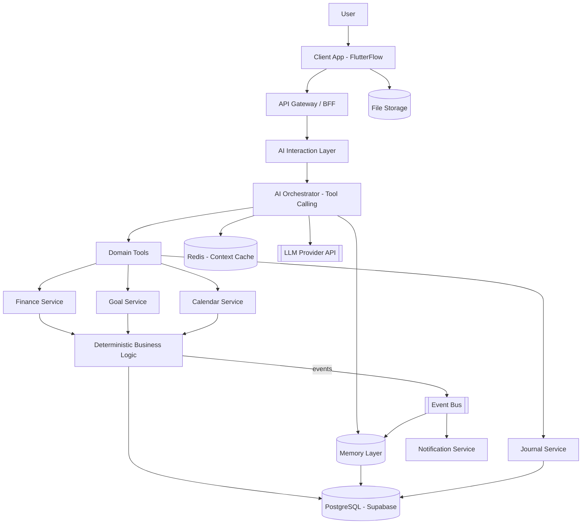

# LifeOS AI — بازبینی محصول و معماری کامل

سند زیر یک نقد جدی و یک معماری عملی برای ساخت واقعی محصول است، نه یک تأیید کورکورانه ایده.
قبل از هر چیز یک اصل را روشن می‌کنم: **این ایده در سطح مفهومی قوی است، اما در سطح فعلی، قابل ساخت به‌عنوان یک محصول اول (v1) نیست.** حجم دامنه (scope) آن معادل حداقل ۵ محصول SaaS جدی است. بخش زیادی از تلاش من در این سند صرف "کوچک کردن هوشمندانه" دامنه خواهد شد، نه اضافه کردن ایده جدید.

---

## Phase 1 — نقد محصول

### ۱. چه چیزی واقعاً ارزشمند است؟
- **ثبت اطلاعات به زبان طبیعی** (به‌ویژه مالی) — این یک UX واقعی و متمایزکننده است. کاربران از فرم متنفرند.
- **حافظه شخصی‌شده** که در طول زمان کاربر را می‌شناسد — این هسته ارزش محصول است، نه یک فیچر جانبی.
- **اتصال منطقی بین حوزه‌ها** (خواب ↔ انرژی ↔ بهره‌وری) — ارزش بلندمدت واقعی دارد، اما نباید در v1 باشد.
- **کنترل کامل کاربر روی حافظه/داده** — این هم یک مزیت رقابتی است و هم یک الزام اعتماد.

### ۲. چه چیزی غیرضروری است (برای شروع)؟
- Life Graph به‌عنوان یک گراف صریح و قابل تحلیل.
- Multi-Agent Architecture با Agentهای مجزا برای هر دامنه.
- ماژول‌های Family، Children، Education، Career، Home، Car، Travel، Relationships، Personal Growth — همه این‌ها در سند به‌عنوان "Domain Modules آینده" آمده‌اند و **باید همین‌طور بمانند**، نه این‌که حتی طراحی اولیه بگیرند.
- Voice input در Journal (در v1).
- تحلیل الگوی رفتاری خودکار (pattern discovery) — این یک قابلیت AI پیشرفته و پرهزینه است که بدون داده‌ی کافی کاربر، فقط توهم هوشمندی تولید می‌کند.

### ۳. چه چیزی بیش‌ازحد بلندپروازانه است؟
خودِ چارچوب "Life Operating System" به‌عنوان نقطه شروع. این یک **چشم‌انداز ۳ تا ۵ ساله** است، نه یک محصول اول. ساخت مستقیمِ ۶ ماژول + AI مرکزی + Memory + Life Graph همزمان، تقریباً تضمین می‌کند که محصول هرگز عرضه نشود.

### ۴. چه چیزی باعث ترک کاربر می‌شود؟
- **Onboarding سنگین.** اگر کاربر مجبور شود پروفایل کامل را از ابتدا پر کند، در همان روز اول می‌رود.
- **عدم دقت AI در استخراج اطلاعات مالی.** یک اشتباه در ثبت هزینه، اعتماد را برای همیشه از بین می‌برد.
- **حس نظارت/Big Brother.** وقتی سیستم همه‌چیز زندگی کاربر را می‌داند، اگر شفافیت درباره‌ی حافظه و کنترل وجود نداشته باشد، کاربر احساس ناامنی می‌کند.
- **کندی و پیچیدگی UI** به‌خاطر تلاش برای نمایش همه‌چیز در یک‌جا.
- **هزینه بالای استفاده از AI** برای کاربر یا برای شما (اگر مدل قوی روی هر پیام صدا زده شود).

### ۵. چه چیزهایی نباید ساخته شوند (حداقل نه در v1، شاید هرگز)؟
- Agentهای مستقل چندگانه با تصمیم‌گیری خودمختار.
- Graph Database.
- سیستم توصیه سرمایه‌گذاری (این را خودتان هم درست حذف کرده‌اید — تأیید می‌شود).
- ماژول سلامت پزشکی (درست حذف شده — تأیید می‌شود).
- تحلیل احساسات پیشرفته (emotion AI) روی متن Journal در فاز اول.
- Notification Engine هوشمند و پیش‌بینی‌کننده در v1؛ نسخه اول فقط باید یادآوری‌های ساده و قطعی (rule-based) داشته باشد.

### ۶. MVP باید چه باشد؟
جواب کامل در Phase 12 آمده، اما اصل کلی: **AI Chat + Memory پایه + Finance مکالمه‌ای + Journal ساده + Task/Calendar ساده.** همین. بدون Goal Tree، بدون Life Graph، بدون Fitness.

### ۷. چه چیزی باید به تعویق بیفتد؟
Life Graph، Multi-Agent، Fitness Module، Domain Modules آینده، Voice input، گزارش‌های تحلیلی پیشرفته، Personality insight خودکار.

### ۸. بزرگ‌ترین ریسک‌های محصول
| ریسک | توضیح |
|---|---|
| **Scope Creep بی‌پایان** | این نوع محصول ذاتاً قابلیت "بی‌نهایت گسترش" دارد؛ بدون مرز سخت‌گیرانه هرگز تمام نمی‌شود. |
| **هزینه AI** | تعامل مکالمه‌ای مداوم با LLM قوی روی حجم بالای پیام، هزینه واحد اقتصادی (unit economics) را می‌تواند منفی کند. |
| **اعتماد و حریم خصوصی** | داده‌های مالی + روانی + خانوادگی در یک‌جا؛ یک نشت داده، محصول را نابود می‌کند. |
| **دقت استخراج اطلاعات** | خطای مالی قابل بخشش نیست. |
| **بدون-برنامه‌نویس بودن بنیان‌گذار در برابر پیچیدگی AI Orchestration** | بخش AI این پروژه، فنی‌ترین بخش کل صنعت نرم‌افزار امروز است؛ no-code به‌تنهایی برای آن کافی نیست (جزئیات در Phase 10). |

---

## Phase 2 — معماری مفهومی محصول

پیشنهاد اصلاح‌شده (لایه AI Orchestrator و Memory جای‌شان عوض شده و یک لایه Deterministic Services اضافه شده، چون AI نباید مستقیم به داده مالی بنویسد):

```
User
  ↓
Client App (Mobile/Web)
  ↓
API Gateway / BFF
  ↓
AI Interaction Layer  (chat, intent parsing, NLU)
  ↓
AI Orchestrator  (tool-calling, context assembly, permission checks)
  ↓ (calls as tools, not as "agents with autonomy")
Domain Services  (Finance Service, Journal Service, Goal Service, Calendar Service)
  ↓
Deterministic Business Logic  (financial calculations, budget checks — NO AI here)
  ↓
Data Layer  (PostgreSQL + Object Storage)

Memory Layer  ⇄ در کنار AI Orchestrator قرار دارد و به همه لایه‌ها سرویس می‌دهد (نه زیر Domain Modules)
```

تفاوت کلیدی با پیشنهاد اولیه شما: Memory یک لایه‌ی عمودی (cross-cutting) است، نه یک ایستگاه در مسیر خطی. و بین AI Orchestrator و داده، یک لایه **Deterministic Business Logic** وجود دارد که AI هرگز مستقیماً آن را دور نمی‌زند (قانون شماره ۶ خودتان).

---

## Phase 3 — معماری AI

### تصمیم اصلی: Multi-Agent لازم نیست.

Multi-Agent Architecture (چند Agent خودمختار که با هم "مذاکره" می‌کنند) برای این محصول **over-engineering** است. مشکلاتش:
- Debug کردن سخت است.
- هزینه (چند فراخوانی LLM به‌جای یک) بالاست.
- Latency بالا می‌رود.
- برای این سطح از پیچیدگی، سود واقعی ندارد.

**پیشنهاد جایگزین: یک مدل مرکزی + معماری Tool-Calling (Function Calling).**
یعنی همان چیزی که در سؤال خودتان به‌عنوان "Modular AI / Tool-based Agent" مطرح کردید — همان درست است.

```
User Message
   ↓
AI Orchestrator (single LLM call with system prompt + available tools)
   ↓
Tool Calls:
   - get_finance_context(user_id)
   - create_expense(...)
   - get_journal_entries(range)
   - search_memory(query)
   - create_goal(...)
   ↓
Deterministic Services اجرا می‌کنند و نتیجه را برمی‌گردانند
   ↓
LLM پاسخ نهایی را با نتایج Tool تولید می‌کند
```

هر "ماژول" (Finance، Goal، Journal، Calendar) به‌جای این‌که یک AI Agent مستقل باشد، فقط یک **مجموعه Tool** با توضیح واضح است که به یک مدل واحد داده می‌شود. این هم پیچیدگی را کم می‌کند و هم هزینه را.

### مدل: یک مدل یا چند مدل؟
- برای مکالمه اصلی و استخراج اطلاعات: **یک مدل متوسط/قوی** (نه لزوماً گران‌ترین مدل بازار).
- برای وظایف ساده و تکراری (مثل دسته‌بندی یک تراکنش با متن کوتاه): یک **مدل کوچک/ارزان** برای کاهش هزینه.
این یعنی "چند مدل بر اساس وظیفه"، نه "چند Agent مستقل با هویت جداگانه".

### RAG / Embeddings / Vector DB — لازم است؟
**نه در v1.** حجم داده کاربر در ابتدا کوچک است (چند صد پیام، چند ده رکورد). برای این حجم:
- می‌توان همه Memory مرتبط را مستقیم در Prompt Context قرار داد (structured retrieval از PostgreSQL، نه semantic search).
- Vector DB زمانی معنا پیدا می‌کند که حجم Journal/مکالمات آن‌قدر زیاد شود که جستجوی متنی ساده کافی نباشد (فاز ۳ به بعد در Roadmap).

### Knowledge Graph — لازم است؟
نه. توضیح کامل در Phase 5.

### Redis
بله، برای session/context caching مکالمه فعلی و rate limiting — این ابزار سبک و کم‌هزینه‌ای است، نه over-engineering.

### معماری کامل AI Pipeline
1. **AI Gateway** — یک لایه واسط بین اپ و provider مدل (برای سوییچ راحت بین OpenAI/Anthropic/... و کنترل هزینه/لاگ).
2. **Intent Detection** — همان مدل اصلی با System Prompt مناسب تشخیص می‌دهد پیام به کدام Domain مربوط است (نیازی به مدل جدا نیست).
3. **Context Assembly** — Memory Layer، پروفایل کاربر، و تاریخچه کوتاه مکالمه را جمع می‌کند.
4. **Function/Tool Calling** — مدل تصمیم می‌گیرد کدام Tool را صدا بزند.
5. **Permission Layer** — قبل از اجرای هر Tool حساس (مثلاً ثبت تراکنش، حذف داده)، تأیید صریح کاربر یا حداقل نمایش "این کار را انجام می‌دهم، درست است؟" لازم است.
6. **Safety Layer** — فیلتر پیام‌های خطرناک (مثلاً کاربر در حال بحران روانی)، جلوگیری از این‌که AI مشاوره مالی/پزشکی/سرمایه‌گذاری بدهد.
7. **Response Generation.**
8. **Evaluation** — لاگ کردن دقت استخراج اطلاعات مالی برای بازبینی دوره‌ای (حداقل به‌صورت دستی در ابتدا).

---

## Phase 4 — معماری Memory

### انواع Memory

| نوع | محتوا | Storage | مثال |
|---|---|---|---|
| **Profile Memory** | اطلاعات ساختاریافته و نسبتاً پایدار | PostgreSQL (جداول ساختاریافته) | شغل، تحصیلات، اعضای خانواده |
| **Preference Memory** | ترجیحات صریح کاربر | PostgreSQL (key-value با provenance) | "من گوشت قرمز نمی‌خورم" |
| **Episodic Memory** | رویدادهای مشخص با زمان | PostgreSQL (events/journal جداول) | "۱۵ مرداد به مسافرت رفتم" |
| **Semantic/Derived Insights** | برداشت‌های AI از الگوها | جدول جدا با **confidence score** و **provenance** | "کاربر معمولاً آخر ماه استرس مالی دارد" |
| **Working/Conversation Memory** | context مکالمه فعلی | Redis (کوتاه‌مدت) | چند پیام آخر |

### قانون طلایی: Semantic/Derived Insights هرگز به‌عنوان Fact ذخیره نمی‌شوند.
هر برداشت AI باید دارای این فیلدها باشد:
- `confidence` (عدد بین ۰ تا ۱)
- `source` (کدام مکالمه/رویداد این برداشت را تولید کرده)
- `status`: `suggested` / `confirmed_by_user` / `rejected_by_user`
- تا وقتی کاربر تأیید نکرده، این برداشت **در Prompt به‌عنوان "حدس" نه "واقعیت" معرفی می‌شود** (مثلاً: «به نظر می‌رسد شما ... — اگر درست است بگویید تا ذخیره کنم»).

این دقیقاً پاسخ به نگرانی شما درباره‌ی "AI هر برداشتی را حقیقت دائمی ذخیره نکند."

### Retrieval و Ranking
در v1 نیازی به رتبه‌بندی پیچیده نیست: کوئری ساختاریافته بر اساس نوع پیام و ماژول مرتبط کافی است (مثلاً اگر پیام درباره خرج است، فقط Finance Memory + Preference مرتبط بازیابی شود).

### Expiration
- Working Memory: چند ساعت.
- Derived Insights تأییدنشده: بعد از N روز اگر تأیید نشد، منقضی/آرشیو شود (کاربر را با پرسش کوتاه اذیت نکند).

### کنترل کاربر
یک صفحه‌ی "حافظه من" باید وجود داشته باشد که:
- همه Memory را با دسته‌بندی نشان دهد.
- امکان ویرایش/حذف تک‌تک آیتم‌ها.
- Export کامل (JSON/PDF).
- امکان "خاموش کردن" ذخیره حافظه برای یک بازه یا یک موضوع خاص (مثلاً "چیزهایی که درباره خانواده‌ام می‌گویم را ذخیره نکن").

---

## Phase 5 — معماری داده (مدل مفهومی)

### تصمیم: Graph Database لازم نیست.

دلیل: روابط "Life Graph" (مثل Sleep→Energy→Mood) در ابتدا **تعداد کمی الگوی از پیش‌تعریف‌شده** هستند، نه یک گراف پویا با میلیون‌ها یال که نیاز به graph traversal پیچیده دارد. این روابط را می‌توان با:
- جداول رابطه‌ای معمولی (foreign keys)
- یک جدول `derived_insights` که رابطه‌های کشف‌شده را با `source_entity`, `target_entity`, `relation_type`, `confidence` نگه می‌دارد
- Eventهای دامنه (Phase 7)

به‌طور کامل پیاده‌سازی کرد. اگر روزی واقعاً به تحلیل گراف پیچیده (مثلاً "همه مسیرهای ارتباطی بین ۵ حوزه") نیاز شد، آن‌وقت می‌توان یک لایه گراف را **روی همین داده رابطه‌ای** ساخت (مثلاً با Neo4j به‌عنوان read-model)، نه از اول.

### موجودیت‌های اصلی (خلاصه، نه DDL کامل)

```
User (1) ── (1) Profile
User (1) ── (N) Goal ── (N) Milestone
User (1) ── (N) JournalEntry ── (0..1) MoodRecord
User (1) ── (N) Account ── (N) Transaction
Transaction (N) ── (1) Category
User (1) ── (N) Debt / Receivable / Installment
User (1) ── (N) Budget ── (1) Category
User (1) ── (N) Asset / Liability
User (1) ── (N) Task/Event (Calendar)
User (1) ── (N) Memory  (Profile/Preference/Episodic/Derived — polymorphic یا جدول جدا برای هرکدام)
User (1) ── (N) AIConversation ── (N) AIMessage ── (N) AIAction (tool calls انجام‌شده، با نتیجه و timestamp)
User (1) ── (N) Notification
```

نکات کلیدی:
- `Transaction` باید `source: 'manual' | 'ai_extracted'` و `confirmed_by_user: boolean` داشته باشد — هرگز تراکنش مالی بدون تأیید نهایی ذخیره نشود (یا حداقل به‌صورت pending).
- `AIAction` یک audit log کامل از هر کاری است که AI روی داده کاربر انجام داده — برای اعتماد و دیباگ حیاتی است.

---

## Phase 6 — ارتباط بین ماژول‌ها

**تصمیم: Event-driven، نه فراخوانی مستقیم بین ماژول‌ها.**

هر Domain Module فقط با Data Layer خودش و با انتشار/گوش‌دادن به Eventها کار می‌کند؛ هیچ‌وقت مستقیماً کد یا جدول ماژول دیگر را صدا نمی‌زند. این باعث می‌شود بتوانید بعداً یک ماژول را بدون شکستن بقیه تغییر دهید یا حذف کنید (که با اصل شماره ۱۱ خودتان — "هر چیزی نباید ماژول شود" — کاملاً هم‌راستاست).

```
Finance ──publishes──▶ ExpenseCreated ──consumed by──▶ Goal (اگر مرتبط با هدف پس‌انداز باشد)
Calendar ──publishes──▶ TaskCompleted ──consumed by──▶ AI Memory / Journal (پیشنهاد نوشتن ژورنال)
Journal ──publishes──▶ MoodRecorded ──consumed by──▶ AI Memory (derived insight)
Fitness ──publishes──▶ WorkoutMissed(3 days) ──consumed by──▶ Journal / AI (پیشنهاد گفتگو، نه اعلان سرزنش‌آمیز)
```

در v1 حتی می‌توان یک **صف پیام ساده (in-process یا یک Queue سبک)** به‌جای Kafka/RabbitMQ کامل استفاده کرد. سیستم پیام‌رسانی سنگین برای مقیاس یک کاربر تک‌نفره در MVP، over-engineering است.

---

## Phase 7 — معماری Event

### Eventهای کلیدی و ناشر/مصرف‌کننده

| Event | ناشر | مصرف‌کننده(ها) | AI واکنش نشان دهد؟ |
|---|---|---|---|
| `ExpenseCreated` | Finance | Budget checker, Goal | فقط اگر نزدیک سقف بودجه باشد → اعلان |
| `IncomeCreated` | Finance | Goal, Report | خیر (فقط ثبت) |
| `BudgetThresholdReached` | Budget checker | Notification | بله — پیام هشدار |
| `GoalCreated` | Goal | Calendar (برای زمان‌بندی اولیه) | بله — پیشنهاد تقسیم به مراحل |
| `GoalProgressUpdated` | Goal | Journal (اختیاری) | فقط دوره‌ای، نه هر بار |
| `TaskCompleted` / `TaskMissed` | Calendar | AI Memory | فقط اگر الگوی تکراری باشد (نه هر بار) |
| `JournalEntryCreated` | Journal | AI Memory (derived insight candidate) | خیر بلافاصله؛ به‌صورت batch/دوره‌ای تحلیل شود |
| `WorkoutCompleted` | Fitness | Journal | خیر |
| `InstallmentDue` | Finance | Notification | بله — یادآوری قطعی (rule-based، نه AI) |

### اصل مهم: AI نباید به هر Event واکنش لحظه‌ای نشان دهد.
واکنش لحظه‌ای زیاد = مزاحمت و هزینه بالا. قاعده: Eventهای **قطعی و بحرانی** (سررسید قسط، عبور از بودجه) rule-based و فوری هستند؛ Eventهای **الگویی** (خستگی مکرر، عدم ورزش) به‌صورت **دوره‌ای (روزانه/هفتگی، batch)** توسط AI بررسی می‌شوند، نه real-time.

---

## Phase 8 — معماری UX

### اصل: Progressive Profiling — نه یک فرم بزرگ.

**۱. Onboarding اول:**
فقط ۳-۴ سؤال حیاتی (نام، هدف کلی از استفاده، آیا می‌خواهد مالی را هم مدیریت کند). زیر ۲ دقیقه.

**۲. AI Interview پیوسته، نه یک‌باره:**
پروفایل در طول هفته‌ها از طریق مکالمات عادی تکمیل می‌شود. AI هر چند وقت یک‌بار یک سؤال کوتاه و طبیعی می‌پرسد ("راستی، شغلت چیه؟") نه یک لیست ۵۰ تایی.

**۳. Daily Dashboard:**
یک خلاصه‌ی کوتاه: تراکنش‌های امروز، تسک‌های امروز، یک نکته از AI (نه گزارش کامل هر ماژول).

**۴. Chat with AI:**
نقطه ورود اصلی برای اکثر تعاملات.

**۵. Quick Actions:**
دکمه‌های سریع برای کارهای پرتکرار (ثبت هزینه، ثبت تسک) — چون همه‌چیز نباید مکالمه‌ای باشد؛ گاهی تایپ سریع بهتر از چت است.

**۶-۹. Module Navigation, Notifications, Reports:**
هر ماژول یک صفحه ساده مستقل دارد؛ گزارش‌ها ساده و متنی/نموداری (نه dashboard تحلیلی سنگین در v1).

**۱۰. Memory Management:**
صفحه شفاف "AI درباره من چه می‌داند" — این برای اعتماد حیاتی است، پیشنهاد می‌کنم در v1 هم باشد، حتی ساده.

---

## Phase 9 — امنیت و حریم خصوصی

اصول Privacy-first:
- **رمزنگاری در حالت سکون** برای جداول حساس (مالی، Journal) — حتی اگر PostgreSQL معمولی است، از field-level یا at-rest encryption استفاده شود.
- **Authentication**: از یک سرویس آماده (Supabase Auth / Firebase Auth / Auth0) استفاده شود؛ ساختن Auth از صفر در این پروژه توجیهی ندارد.
- **Authorization**: هر کاربر فقط به داده خودش دسترسی دارد (Row-Level Security در PostgreSQL/Supabase توصیه می‌شود).
- **Data isolation**: هیچ داده‌ای بین کاربران به‌اشتباه نباید به AI Context نشت کند — تست دقیق لازم دارد.
- **AI Provider Privacy**: باید صریحاً بررسی شود که provider مدل، داده کاربر را برای آموزش نگه نمی‌دارد (Data Processing Agreement/Zero retention).
- **Audit Log**: هر AIAction (چه چیزی نوشته/تغییر داده) باید لاگ شود.
- **Backup**: بکاپ روزانه، رمزنگاری‌شده.
- **Export/Delete**: کاربر باید بتواند تمام داده خودش را Export کند (JSON) و کامل حذف کند (Right to be forgotten) — این هم الزام اعتماد و هم (اگر کاربر اروپایی/محلی مشابه داشته باشید) الزام قانونی.
- **Consent**: رضایت صریح برای این‌که کدام داده به AI provider خارجی ارسال می‌شود.

---

## Phase 10 — استراتژی No-Code / Low-Code

### واقع‌بینانه است، اما با یک محدودیت مهم:

**بخش‌هایی که واقعاً با No-Code قابل ساخت‌اند:**
- CRUD ماژول‌ها (Finance forms, Journal, Calendar UI ساده) → **FlutterFlow یا Bubble یا WeWeb**
- Database و Auth → **Supabase** (پیشنهاد قوی‌تر از Firebase برای این پروژه، چون PostgreSQL واقعی زیرش است و بعداً migration به backend سفارشی راحت‌تر است)
- اتوماسیون‌های ساده (یادآوری قسط، ارسال نوتیفیکیشن دوره‌ای) → **n8n یا Make**

**بخشی که نباید No-Code باشد: هسته AI Orchestration.**
منطق Tool-Calling، مدیریت Context، Permission Layer و Memory Retrieval پیچیده‌تر از چیزی است که n8n/Make به‌خوبی مدیریت کنند (قابل انجام است برای نسخه‌ی خیلی ساده، اما شکننده و سخت debug می‌شود). پیشنهاد:

**معماری هیبرید برای MVP:**
- Frontend: FlutterFlow (یا Bubble) → سریع، بدون کد
- Database/Auth/Storage: Supabase
- **AI Backend: یک سرویس کوچک سفارشی (حتی چند صد خط کد)** که فقط مسئول AI Orchestration و Tool-Calling است — این بخش را می‌توان با کمک یک توسعه‌دهنده فریلنسر یا حتی خود Claude Code به‌صورت هدایت‌شده ساخت، بدون نیاز به تیم بزرگ.
- ارتباط FlutterFlow ↔ AI Backend از طریق یک API ساده (REST).

این معماری به شما اجازه می‌دهد ۸۰٪ محصول را بدون کدنویسی بسازید و فقط قلب هوشمند آن (که مهم‌ترین بخش رقابتی محصول است) را کنترل‌شده و درست بسازید.

**چطور از Vendor Lock-in دور بمانیم؟**
- روی Supabase: از PostgreSQL استاندارد استفاده کنید نه فیچرهای خیلی اختصاصی → migration به backend خودتان بعداً راحت است.
- روی FlutterFlow: منطق تجاری را داخل FlutterFlow ننویسید؛ آن را در AI Backend/Supabase Functions نگه دارید تا Frontend همیشه قابل بازسازی باشد.

**برای بلندمدت:**
وقتی محصول اعتبار پیدا کرد و کاربر واقعی داشت، Frontend را به یک اپ native/React Native با تیم واقعی مهاجرت دهید؛ Backend AI از همان ابتدا سفارشی بوده، پس این بخش نیازی به بازنویسی ندارد.

---

## Phase 11 — Stack پیشنهادی

| لایه | پیشنهاد | چرا | جایگزین | هزینه/پیچیدگی |
|---|---|---|---|---|
| Frontend (MVP) | FlutterFlow | سریع، بدون کد، خروجی موبایل واقعی | Bubble (بیشتر برای وب) | کم |
| Database | Supabase (PostgreSQL) | رابطه‌ای واقعی، RLS، مهاجرت‌پذیر | Firebase (NoSQL، سخت‌تر برای داده رابطه‌ای مالی) | کم/متوسط |
| Auth | Supabase Auth | یکپارچه با DB | Auth0 | کم |
| AI Backend | سرویس سفارشی سبک (Node/Python) | کنترل کامل روی Orchestration | n8n (فقط برای MVP خیلی ساده) | متوسط |
| LLM Provider | Claude یا GPT (بر اساس تست کیفیت استخراج فارسی) | باید تست عملی شود، فارسی حساس است | — | بر اساس مصرف |
| Vector DB | ندارد در v1 | حجم داده کم است | pgvector (وقتی لازم شد، همان Postgres) | — |
| Cache/Session | Redis (Upstash برای سرورless) | ارزان، مدیریت‌شده | — | کم |
| Storage فایل | Supabase Storage | یکپارچه | S3 | کم |
| Notification | OneSignal یا Supabase + Cron | ساده و مدیریت‌شده | — | کم |
| Monitoring | Sentry + لاگ ساده | خطاها و هزینه AI را رصد کنید | — | کم |
| Deployment AI Backend | Railway / Render / Fly.io | ساده‌تر از AWS خام برای شروع | AWS/GCP (بعداً) | کم |

---

## Phase 12 — تعریف MVP

هدف MVP: **اثبات این‌که ثبت مکالمه‌ای + حافظه شخصی، تجربه‌ای است که کاربر هر روز به آن برمی‌گردد.**

**داخل MVP:**
- AI Chat با Tool-Calling پایه
- Finance مکالمه‌ای (ثبت تراکنش، حساب‌ها، دسته‌بندی، گزارش ساده ماهانه، بودجه ساده)
- Journal ساده (متنی، بدون تحلیل الگوی خودکار پیچیده)
- Task/Calendar ساده (بدون AI scheduling هوشمند، فقط CRUD + یادآوری)
- Memory پایه (Profile + Preference + Episodic) با صفحه مدیریت حافظه
- Onboarding سبک (۳-۴ سؤال + تکمیل تدریجی)

**خارج از MVP:**
- Goal/Life Tree (می‌تواند نسخه خیلی ساده‌ی بعدی باشد)
- Fitness & Nutrition
- Life Graph و Derived Insights خودکار
- Multi-domain cross-analysis
- Voice input
- Notification هوشمند پیش‌بینی‌کننده

هر فیچر MVP دلیل مشخصی دارد: **بدون Finance مکالمه‌ای هیچ تمایزی نسبت به یک اپ یادداشت‌برداری معمولی وجود ندارد؛ بدون Memory، محصول یک چت‌بات معمولی است.** این دو، هسته‌ی اثبات ارزش محصول‌اند. بقیه (Goal, Fitness, Graph) لایه‌های بعدی ارزش‌اند.

---

## Phase 13 — Roadmap

### Phase 0 — Product Validation (۲-۴ هفته)
اعتبارسنجی با کاربر واقعی (حتی با یک نمونه‌ی نیمه‌دستی/Wizard-of-Oz: خودتان پشت صحنه بخشی از "AI" باشید و ببینید آیا مردم واقعاً می‌خواهند این‌طور با اپ حرف بزنند).
ریسک: بدون این مرحله، ممکن است ماه‌ها روی چیزی بسازید که کسی نمی‌خواهد.

### Phase 1 — MVP (۲-۳ ماه با معماری هیبرید No-Code)
موارد Phase 12. وابستگی: انتخاب نهایی Stack و تست کیفیت استخراج فارسی توسط LLM.
پیچیدگی فنی: متوسط (بخش AI Orchestration مهم‌ترین ریسک فنی است).
ارزش محصول: بالا — اولین نسخه‌ای که واقعاً "احساس LifeOS" می‌دهد.

### Phase 2 — AI Personalization
افزودن Goal Module کامل، بهبود Memory (Derived Insights با تأیید کاربر)، شخصی‌سازی لحن AI.
وابستگی: داده کافی از کاربران واقعی MVP.
ریسک: کیفیت insight های AI اگر ضعیف باشد، اعتماد را کم می‌کند — نیاز به confidence threshold محافظه‌کارانه.

### Phase 3 — Cross-module Intelligence
اتصال Finance↔Goal↔Calendar، شروع تحلیل الگوهای ساده (نه گراف کامل).
پیچیدگی فنی: بالا.
ارزش: اینجا محصول شروع به تمایز واقعی از رقبا می‌کند.

### Phase 4 — Advanced Life Graph / Intelligence
گراف واقعی روابط (احتمالاً به‌صورت read-model روی داده رابطه‌ای، نه لزوماً graph DB مستقل)، افزودن Fitness Module، تحلیل بلندمدت.
ریسک: over-engineering اگر زودتر از نیاز واقعی کاربران انجام شود.

### Phase 5 — Scale
مهاجرت احتمالی از No-Code Frontend به اپ سفارشی، بهینه‌سازی هزینه AI (caching, مدل‌های کوچک‌تر برای وظایف ساده)، زیرساخت مقیاس‌پذیر.

---

## Phase 14 — دیاگرام نهایی معماری (Mermaid)



---

## خلاصه نهایی

### تصمیم‌های محصولی که شما گرفته‌اید و تأیید می‌شوند
- حذف ماژول سلامت پزشکی ✅
- عدم مشاوره سرمایه‌گذاری در Finance ✅
- اصل "همه‌چیز نباید ماژول شود" ✅
- ثبت مالی مکالمه‌ای ✅
- کنترل کامل کاربر روی Memory ✅

### توصیه‌های من (جایگزین یا اصلاح ایده اولیه)
- Multi-Agent → **Tool-Calling با یک مدل مرکزی**
- Graph Database → **PostgreSQL رابطه‌ای + جدول derived_insights**
- Life Graph کامل → **به تعویق بیفتد تا Phase 3/4 Roadmap**
- ماژول‌های Domain آینده (Family, Career, Travel, ...) → **حتی طراحی هم نشوند تا زمانی که تقاضای واقعی کاربر دیده شود**
- Memory باید دارای `confidence` و `provenance` باشد و insight ها را به‌عنوان "حدس" نه "واقعیت" نگه دارد

### فرضیات (Assumptions) که باید توسط شما تأیید/رد شوند
- کیفیت استخراج اطلاعات مالی فارسی توسط LLM انتخابی، کافی است (باید تست عملی شود).
- بازار هدف اولیه، کاربران فارسی‌زبان هستند (روی انتخاب LLM و لحن UX تأثیر دارد).
- بودجه اولیه اجازه استخدام حداقل یک توسعه‌دهنده (حتی فریلنس/پاره‌وقت) برای بخش AI Backend را می‌دهد.

### سؤالات باز که باید تصمیم بگیرید
1. آیا حاضرید بخش AI Orchestration را (حتی حداقلی) با کد واقعی بسازید، یا اصرار بر ۱۰۰٪ no-code دارید؟ (پاسخ به این سؤال مسیر فنی کل پروژه را تغییر می‌دهد.)
2. مدل درآمدی محصول چیست؟ (روی محدودیت مصرف AI برای کاربر رایگان تأثیر مستقیم دارد.)
3. آیا هدف اولیه بازار ایران/فارسی‌زبان است یا جهانی؟ (روی انتخاب provider پرداخت، LLM، و زیرساخت اثر دارد.)
4. چه سطحی از دقت مالی برای شما "قابل قبول" است — آیا AI اجازه دارد بدون تأیید صریح، تراکنش را نهایی ثبت کند یا همیشه باید pending باشد؟
